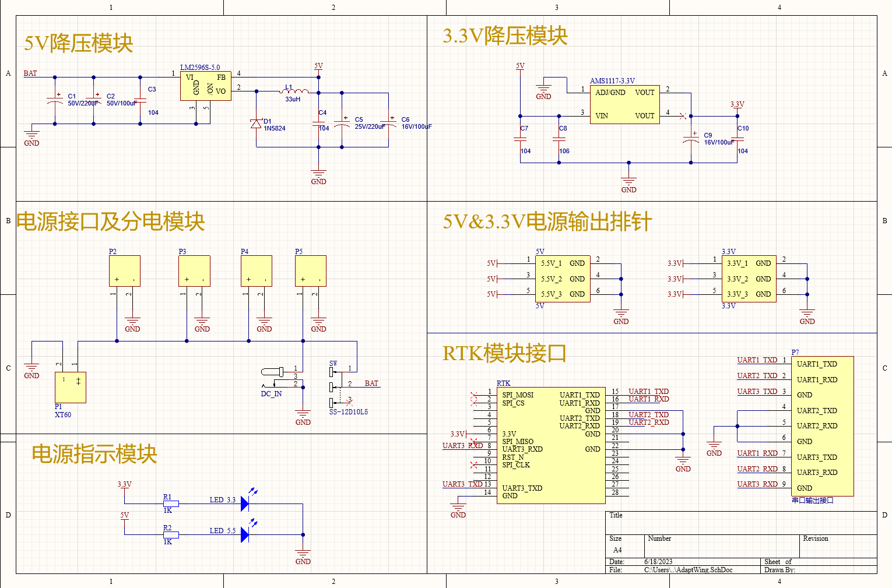
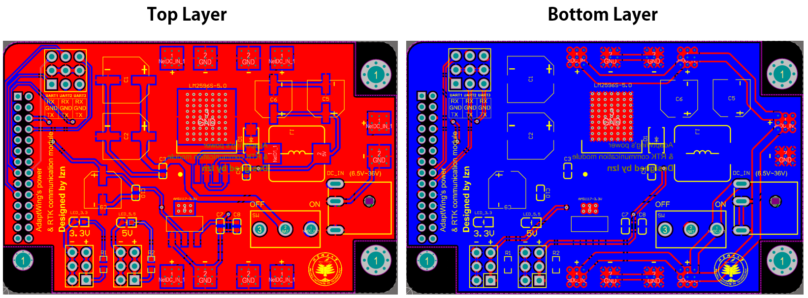
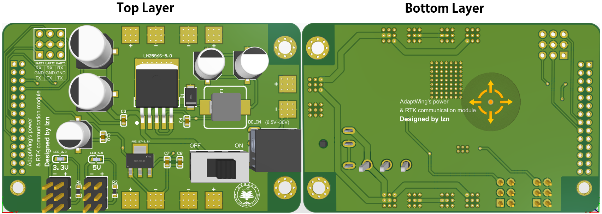

# AdaptPower

## 模块描述

该模块主要由3.3V降压电路和5V降压电路组成，恒定输出稳定的5V和3.3V的电压，输入电压模式提供航模电池焊点与DC电源插座，与四旋翼电调分电板模块融合设计，同时兼容**DM712 系列高精度RTK定位定向模块**，可以作为其底板使用，作为供电与UART通信接口

## 主要芯片

- LM2596S DCDC电源部分是一个直流降压，稳定输出5V模块，具有3A输出电流驱动能力，高效率，低纹波。
- AMS1117 LDO电源部分是一个直流降压，稳定输出3.3V模块，具有800ma输出电流驱动能力。

## 模块参数

- 输入电压：6.5-36V
- 输出电压：5V/3.3V
- 输出电流：3A Max
- 输出纹波：<=25mV
- 转换效率：92%左右
- 工作温度：-40℃-85℃
- PCB尺寸：72*46mm
- 具有过温保护、限流保护功能

## 原理图

	

## PCB

	

## 3D模型

	

## 
